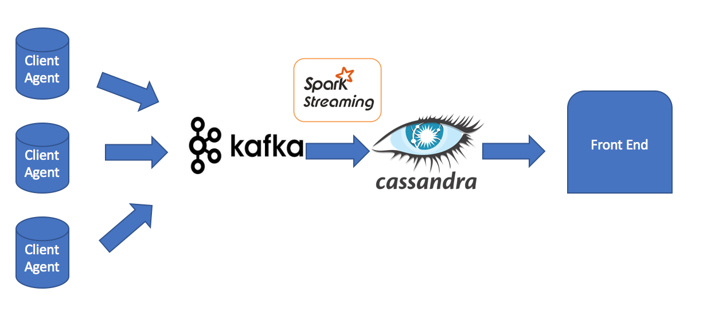

## 1 SQL

```

CREATE TABLE orders
	(customer_id int, order_date date, item_id int, quantity int)
;
	
INSERT INTO orders
	(customer_id, order_date, item_id, quantity)
VALUES
	(1, '2017-1-1',1,22),
	(1, '2017-1-2',2,3),
    (1, '2016-1-2',2,15),
	(2, '2017-2-2',2,3),
    (2, '2016-12-2',2,4),
    (3, '2016-1-3',2,4)
;


CREATE TABLE customer
	(customer_id int, customer_name varchar(7))
;
	
INSERT INTO customer
	(customer_id, customer_name)
VALUES
	(1, 'aaa'),
	(2, 'bbb'),
	(3, 'ccc')
;

```


**latest order of a customer**:

```

select cust.customer_id, cust.customer_name, max(order_date) as latest_order
from customer cust join orders ord
on cust.customer_id = ord.customer_id
group by cust.customer_id, cust.customer_name

```

** largest consecutive increase **


```
select customer_id, (case when max(quantity_increase)> 0 then max(quantity_increase) else 0 end) as max_incrase from
(select customer_id,  item_id, order_date,quantity, quantity - lag(quantity) over (partition by customer_id order by order_date) as quantity_increase
from orders ord) as ord_wt_qty_increase
group by customer_id
```


## 2 Nearest Stars
### a
If the whole file cannot fit into memory, we can read line by line and add the distances to a minheap, once we reached the capacity of our heap, we pop the min number out. The detailed code is pasted below

findstar.py:

```

  1 import sys
  2 import csv
  3 from collections import namedtuple
  4 import heapq
  5
  6 h = []
  7
  8 try:
  9
 10     capacity = int(sys.argv[1])
 11
 12
 13     reader = csv.reader(sys.stdin)
 14     Data = namedtuple("Data", next(reader))
 15     for data in map(Data._make, reader):
 16         if len(h)< capacity:
 17              heapq.heappush(h, (-float(data.dist),[float(data.x),float(data.y),float(data.z)]))
 18         elif float(data.dist)>h[0][0]:
 19              heapq.heappop(h)
 20              heapq.heappush(h, (-float(data.dist),[float(data.x),float(data.y),float(data.z)]))
 21     for i in range(len(h)):
 22         print(-h[i][0],h[i][1])
 23
 24
 25
 26
 27 except ValueError:
 28     print("Please enter an integer")


```

I have also created a bash command in order to read gunzip and parameters. 

```
  1 #!/bin/bash
  2
  3 python findstar.py $1

```

The program can be executed in the following format:

```
gunzip -c hygdata_v3.csv.gz| findstar 10

```

### b 

If the whole file can be read into memory, we could use a structure such as k-d tree to find the nearest neighbor. Also we could pass in a start and an offset parameter which would only give us a portion of the result one time. For example, if we have start=3, offset=2, knearest=9, point=[0,0,0], the program below would find us the nearest 9 coorindates to [0,0,0], but will only give us the 3rd and 4th stars because we start at 3rd and ask for 2 rows(offset).

```
from sklearn.neighbors import KDTree
import pandas as pd

start = 3
offset = 2
point = [0,0,0]
knearest = 9

coord = pd.read_csv("./sample.csv")

tree = KDTree(coord[['x','y','z']])
indexes = tree.query(point,k=knearest,return_distance=False,dualtree=True,sort_results=True)
result = coord[coord.id.isin(indexes[0])][['x','y','z']]

#add an increment index so we can filter the index by offsets
result = result.assign(row_nbr=[i+1 for i in range(len(result))])
print(result[start-1:start-1+offset])


#add an increment index so we can filter the index by offsets
result = result.assign(row_nbr=[i+1 for i in range(len(result))])
print(result[start-1:start-1+offset])


```


## 3 System Design

For the client side, we could use the same design as statsd to utilize UDP since it will be light-weight.


On the server side, to collect data, we could use a message queue system such as Kafka that is clustered to ensure fault tolerance.

To further process the data we could utilize Spark Streaming. For average, we could keep aggregating sum and count of metrics and do a division to retrieve the data. Since the client query will be by date and hour. For min and max, we could aggregate and compare the max/min function of the batch and compare it with the current hour max/min. For median it would be more bit complicated since we have continious data coming in and since it is 10,000/s, we will have 36,000,000 events per hour per metric. It would be hard to keep all the events in memory. However, we could utilize the hyperloglog method, which also has been implemented with Spark Library to estimate the median number.

For Cassandra, data would be stored in the format of metric_key, time(hour level), and stat and value.

In terms of query, we could use nodejs or Java EE as front end, parsing the request to get time and metric and stat and query Cassandra.



### Tradeoffs

- Kafka processes more than once. So we will need to deal with duplicate values in case of network failure
- Hyperloglog is merely an estimation. We are trading off the accuracy for low latency in processing.

### Considerations with Data Increase
- Depending on the volume, we could adjust our cluster size. In addition, we could set up consumer groups in Kafka to read data concurrently. Same on the Spark side, we could add more worker nodes to balance the load.


